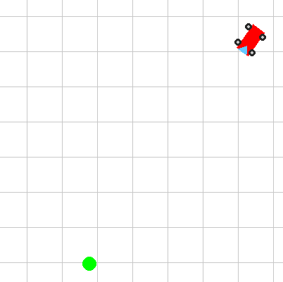

é# 2D Car Simulator with LQR Control

A Python-based 2D car simulator that demonstrates Linear Quadratic Regulator (LQR) control for autonomous vehicle motion. The simulator features real-time visualization using Pygame and includes state trajectory plotting.



## Features

- Real-time 2D car simulation with physics-based motion
- LQR control implementation for precise vehicle control
- Interactive visualization using Pygame
- State trajectory plotting with Matplotlib
- Modular code structure with separate visualization and control components
- Configurable simulation parameters

## Requirements

```
numpy
matplotlib
control
scipy
pygame
```

## Installation

1. Clone the repository:
```bash
git clone https://github.com/username/car-simulator.git
cd car-simulator
```

2. Install the required packages:
```bash
pip install numpy matplotlib control scipy pygame
```

## Usage

Run the simulator using:
```bash
python main.py
```

The simulation will show:
- A real-time visualization of the car moving towards its target
- A coordinate grid for reference
- A green target point
- A red car with blue windshield and black wheels
- After completion, a plot of state trajectories

## Project Structure

- `main.py`: Entry point and simulation loop
- `car_controller.py`: Core control system implementation using LQR
- `visualizer.py`: Visualization components using Pygame and Matplotlib
- `config.py`: Configuration parameters and constants

## How It Works

The simulator uses a Linear Quadratic Regulator (LQR) to control a car in a 2D plane. The car's state consists of:
- Position (x, y)
- Velocity (vx, vy)

The LQR controller computes optimal control inputs to drive the car from its initial state to a target position while minimizing a cost function that balances:
- State error (distance from target)
- Control effort (input magnitude)

The system is modeled in continuous time and discretized for simulation.

## Customization

You can modify the simulation parameters in `config.py`:
- Time step and simulation duration
- LQR weights (Q and R matrices)
- Visualization settings (window size, car dimensions, colors)
- Physical parameters (gravity)

## Contributing

Feel free to open issues or submit pull requests. All contributions are welcome!

## License

This project is licensed under the MIT License - see the LICENSE file for details.

## Author

Tristan - December 2024

## Acknowledgments

- Control Systems theory and LQR implementation based on modern control theory
- Pygame visualization inspired by various game development tutorials
